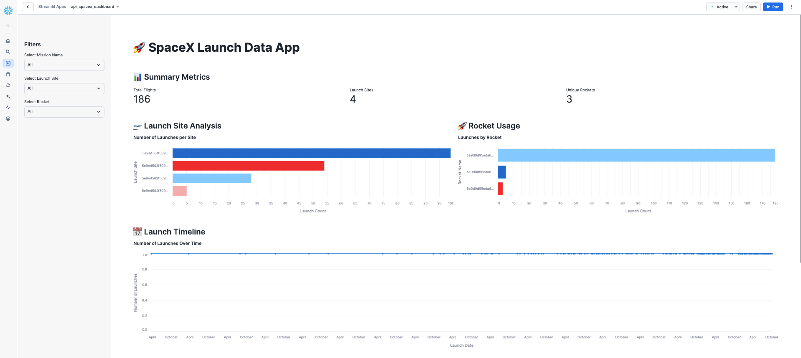

# SpaceX Launch Streamlit in Snowflake Data App

This is a **Streamlit in Snowflake** data application that visualizes SpaceX launch data using **the Snowflake Data Cloud** as the backend. The application provides an interactive UI that allows users to explore launch statistics, including launch site analysis, rocket usage, and launch timelines.

## Features

- **Launch Counts**: Displays the number of launches per site and per rocket.
- **Launch Site Analysis**: Provides a bar chart visualizing the number of launches per site.
- **Rocket Usage**: Shows a bar chart visualizing the number of launches per rocket.
- **Launch Timeline**: Displays a line chart visualizing the number of launches over time.
- **Interactive Filters**: Allows users to filter data by Mission Name, Launch Site, and Rocket.

## Attribution


A Fivetran custom connector built using the Fivetran Connector SDK uses the SpaceX API to source this dataset. While attribution is not required, we acknowledge SpaceX as the data source.

For more information about the SpaceX API, please visit:
[SpaceX API Documentation](https://github.com/r-spacex/SpaceX-API)

## Requirements

Here is the link to the [Fivetran Connector SDK SpaceX quick start example](https://github.com/kellykohlleffel/Fivetran_Connector_SDK/tree/main/examples/quick_start_examples/spacex).

To run this application, ensure the following dependencies are installed:

- Python 3.7 or higher
- Streamlit
- Pandas
- Altair
- Snowflake Snowpark (for interacting with Snowflake)

You can install the required Python packages with the following command:

```bash
pip install streamlit pandas altair snowflake-snowpark-python
```

## Streamlit in Snowflake SpaceX Data App
```
# SpaceX Launch Data Application
# A Streamlit in Snowflake application visualizing SpaceX launch data.
# Features: Launch counts, launch site analysis, rocket usage, and launch timelines.

import streamlit as st
import pandas as pd
import altair as alt
from snowflake.snowpark.context import get_active_session

# Set page configuration
st.set_page_config(page_title="SpaceX Launch Data App", layout="wide")

# Get the active Snowflake session
session = get_active_session()

# Load data functions
def load_flight_data():
    return session.sql("""
        SELECT FLIGHT_NUMBER, MISSION_NAME, LAUNCH_DATE, ROCKET_NAME, LAUNCH_SITE
        FROM launch
    """).to_pandas()

def launch_site_distribution():
    # Fetch data and rename columns to lowercase
    launch_sites_df = session.sql("""
        SELECT LAUNCH_SITE, COUNT(*) AS Launch_Count
        FROM launch
        GROUP BY LAUNCH_SITE
        ORDER BY Launch_Count DESC
    """).to_pandas()
    
    # Rename columns to lowercase for consistency
    launch_sites_df.columns = [col.lower() for col in launch_sites_df.columns]
    return launch_sites_df

def rocket_distribution():
    # Fetch data and rename columns to lowercase
    rockets_df = session.sql("""
        SELECT ROCKET_NAME, COUNT(*) AS Launch_Count
        FROM launch
        GROUP BY ROCKET_NAME
        ORDER BY Launch_Count DESC
    """).to_pandas()
    
    # Rename columns to lowercase for consistency
    rockets_df.columns = [col.lower() for col in rockets_df.columns]
    return rockets_df  # Ensure the DataFrame is returned

def launch_timeline():
    # Retrieve the data from Snowflake
    timeline_df = session.sql("""
        SELECT TO_DATE(LAUNCH_DATE) AS Launch_Date, COUNT(*) AS Launch_Count
        FROM launch
        GROUP BY TO_DATE(LAUNCH_DATE)
        ORDER BY Launch_Date
    """).to_pandas()

    # Rename columns to lowercase for consistency
    timeline_df.columns = [col.lower() for col in timeline_df.columns]
    
    # Ensure launch_date is datetime and launch_count is numeric
    timeline_df["launch_date"] = pd.to_datetime(timeline_df["launch_date"], errors="coerce")
    timeline_df["launch_count"] = pd.to_numeric(timeline_df["launch_count"], errors="coerce")
    
    # Drop any rows with null values
    timeline_df = timeline_df.dropna(subset=["launch_date", "launch_count"])
    return timeline_df

# Main dashboard
try:
    # Load data
    with st.spinner("Loading SpaceX launch data..."):
        flight_data = load_flight_data()
        launch_sites = launch_site_distribution()
        rockets = rocket_distribution()
        timeline = launch_timeline()

    # Dashboard Title
    st.title("🚀 SpaceX Launch Data App")

    # Add spacing below the title
    st.markdown("<div style='margin-bottom: 40px;'></div>", unsafe_allow_html=True)

    # Sidebar filters
    st.sidebar.header("Filters")

    # Mission Name filter
    mission_names = flight_data["MISSION_NAME"].unique().tolist()
    selected_mission = st.sidebar.selectbox("Select Mission Name", ["All"] + mission_names)

    # Launch Site filter
    selected_site = st.sidebar.selectbox("Select Launch Site", ["All"] + launch_sites["launch_site"].tolist())

    # Rocket Name filter
    selected_rocket = st.sidebar.selectbox("Select Rocket", ["All"] + rockets["rocket_name"].tolist())

    # Apply filters to the dataset
    filtered_data = flight_data.copy()
    if selected_mission != "All":
        filtered_data = filtered_data[filtered_data["MISSION_NAME"] == selected_mission]
    if selected_site != "All":
        filtered_data = filtered_data[filtered_data["LAUNCH_SITE"] == selected_site]
    if selected_rocket != "All":
        filtered_data = filtered_data[filtered_data["ROCKET_NAME"] == selected_rocket]

    # Summary metrics
    st.subheader("📊 Summary Metrics")
    total_flights = len(filtered_data)
    unique_sites = filtered_data["LAUNCH_SITE"].nunique()
    unique_rockets = filtered_data["ROCKET_NAME"].nunique()

    metric_col1, metric_col2, metric_col3 = st.columns(3)
    with metric_col1:
        st.metric("Total Flights", f"{total_flights:,}")
    with metric_col2:
        st.metric("Launch Sites", unique_sites)
    with metric_col3:
        st.metric("Unique Rockets", unique_rockets)

    # Add spacing below the summary metrics
    st.markdown("<div style='margin-bottom: 30px;'></div>", unsafe_allow_html=True)

    # Create layout columns
    col1, col2 = st.columns(2)

    with col1:
        st.subheader("🛫 Launch Site Analysis")
        
        # Update charts based on filtered data
        site_chart_data = (
            filtered_data.groupby("LAUNCH_SITE").size().reset_index(name="Launch_Count")
        )
        site_chart = alt.Chart(site_chart_data).mark_bar().encode(
            x=alt.X("Launch_Count:Q", title="Launch Count"),
            y=alt.Y("LAUNCH_SITE:N", title="Launch Site", sort="-x"),
            color=alt.Color("LAUNCH_SITE:N", legend=None)
        ).properties(
            title="Number of Launches per Site",
            width=500,
            height=300
        )
        st.altair_chart(site_chart, use_container_width=True)

    with col2:
        st.subheader("🚀 Rocket Usage")
        
        # Update charts based on filtered data
        rocket_chart_data = (
            filtered_data.groupby("ROCKET_NAME").size().reset_index(name="Launch_Count")
        )
        rocket_chart = alt.Chart(rocket_chart_data).mark_bar().encode(
            x=alt.X("Launch_Count:Q", title="Launch Count"),
            y=alt.Y("ROCKET_NAME:N", title="Rocket Name", sort="-x"),
            color=alt.Color("ROCKET_NAME:N", legend=None)
        ).properties(
            title="Launches by Rocket",
            width=500,
            height=300
        )
        st.altair_chart(rocket_chart, use_container_width=True)

    # Timeline chart
    st.subheader("📅 Launch Timeline")
    timeline_chart = alt.Chart(timeline).mark_line(point=True).encode(
        x=alt.X("launch_date:T", title="Launch Date"),  # Temporal field
        y=alt.Y("launch_count:Q", title="Number of Launches"),  # Quantitative field
        tooltip=["launch_date:T", "launch_count:Q"]  # Tooltip with proper types
    ).properties(
        title="Number of Launches Over Time",
        width=1000,
        height=400
    )
    st.altair_chart(timeline_chart, use_container_width=True)

    # Add spacing below the visualizations
    st.markdown("<div style='margin-bottom: 50px;'></div>", unsafe_allow_html=True)

    # Interactive data table
    st.subheader("🗂️ Launch Data Details")
    st.dataframe(filtered_data)

except Exception as e:
    st.error(f"An error occurred: {str(e)}")
```
 
